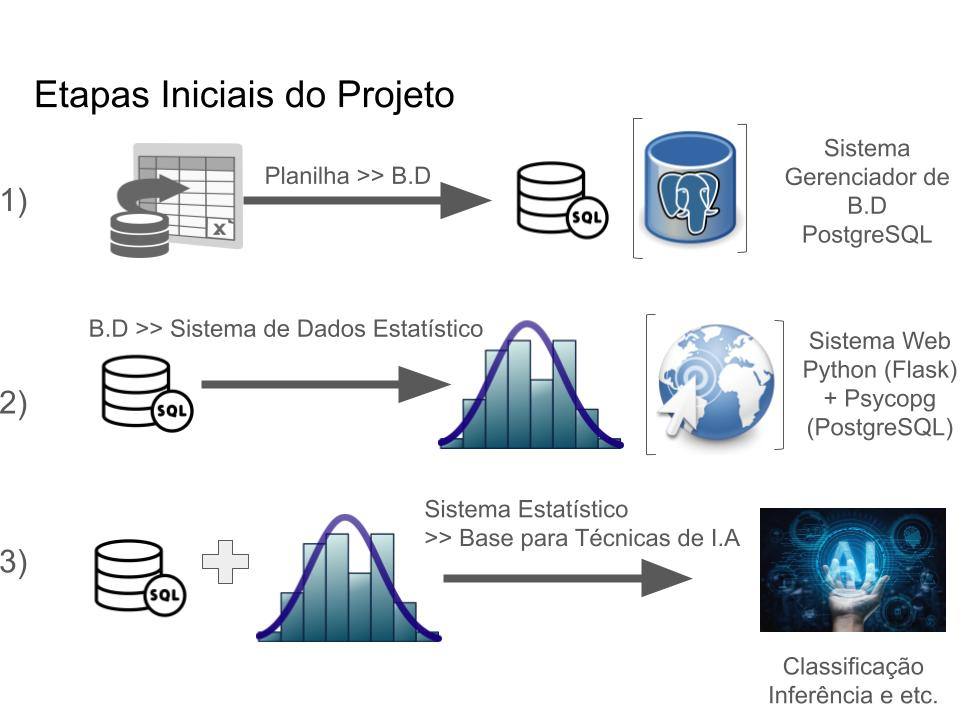
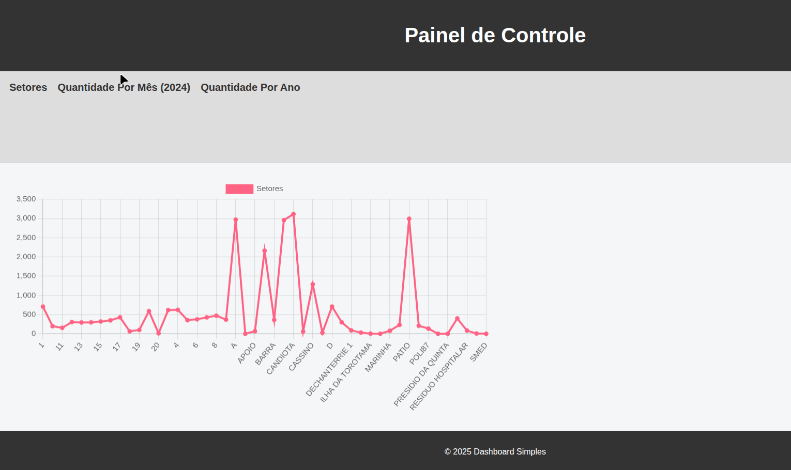

# IFEsCS

<!---->

**Etapas:**



**Demo:**



**Docker (app + banco)**

Para rodar a aplicação e o PostgreSQL em containers:

1. Copie `.env.docker.example` para `.env` (ou ajuste seu `.env` atual).
2. Garanta que `POSTGRES_DB`, `POSTGRES_USER` e `POSTGRES_PASSWORD` estejam definidos no `.env`.
3. Suba os serviços:

```bash
docker compose up --build
```

4. Acesse a aplicação em `http://localhost:5000`.

Observação: o container do PostgreSQL executa automaticamente os scripts em `docker/init` no primeiro startup do volume, incluindo criação das tabelas analíticas e da view `registro`.

Comandos úteis:

```bash
docker compose down
docker compose down -v
```

- `down`: para e remove containers/rede.
- `down -v`: também remove o volume persistente do PostgreSQL.

**Banco de dados em produção**

**Deploy em produção (domínio próprio)**

Para publicar a plataforma em um servidor Linux com Docker:

1. Copie `.env.prod.example` para `.env.prod` e ajuste os valores.
2. Aponte o DNS do seu domínio para o IP do servidor.
3. Suba a stack de produção:

```bash
docker compose -f docker-compose.prod.yml --env-file .env.prod up -d --build
```

4. A aplicação ficará exposta em HTTP na porta 80, com `nginx` na frente e a aplicação servida por `gunicorn`.

Recomenda-se ativar HTTPS com um proxy externo como Nginx Proxy Manager, Traefik ou Certbot no host, apontando para esta stack.

**Deploy simples no Railway (recomendado para testes)**

Se a ideia for disponibilizar a plataforma rapidamente para testes iniciais, uma opção mais simples do que manter um VPS é usar Railway com PostgreSQL gerenciado:

1. Publique o repositório no GitHub.
2. No Railway, crie um projeto e faça o deploy do repositório.
3. Adicione um serviço PostgreSQL no mesmo projeto.
4. No serviço da aplicação, importe as variáveis de `.env.railway.example`.
5. Configure `DATABASE_URL`, `DB_HOST` e `DB_PORT` com referências para o serviço Postgres.
6. Configure o healthcheck em `/health`.
7. Gere primeiro um domínio `*.up.railway.app` para validar a aplicação.
8. Depois adicione um subdomínio próprio, como `app.seudominio.com.br`.

O Railway emite SSL automaticamente para domínios validados. Para provedores como Name.com, o caminho mais simples é usar um subdomínio com registro `CNAME`, em vez do domínio raiz.

A aplicação sincroniza automaticamente o schema ORM e o catálogo de permissões no startup. O comportamento pode ser desativado com a variável `AUTO_MIGRATE_ON_STARTUP=False`, mas o padrão recomendado é manter a sincronização ativa para garantir que roles, páginas, permissões e o usuário administrador inicial existam antes do primeiro acesso.

O processamento de planilhas da página de gerenciamento de arquivos usa a variável `DATABASE_URL`, faz carga incremental (upsert por `ticket`) nas tabelas normalizadas e registra auditoria em `import_auditoria`.

Antes do upsert, as planilhas passam por pré-tratamento obrigatório: normalização de texto/números, validação de campos obrigatórios, validação de ticket e data/hora, descarte de linhas inválidas e consolidação de duplicados por `ticket`.

**Padrão arquitetural**

Este projeto segue Arquitetura em Camadas para páginas e fluxos de negócio:

1. `app/dash_app/pages`: camada de apresentação (layout e callbacks).
2. `app/application`: camada de aplicação (orquestração de casos de uso).
3. `app/infrastructure`: camada de infraestrutura (implementações concretas de banco, arquivos, subprocessos e integrações).
4. `app/models` e banco: camada de domínio e persistência.

Convenção de nomes:

1. `*Port`: contratos da camada de aplicação (ex.: `FileStoragePort`).
2. `*Adapter`: implementações concretas na infraestrutura (ex.: `LocalFileStorageAdapter`).
3. `*Service`: orquestrador da aplicação (ex.: `FileManagementService`).
4. `build_default_*`: fábrica para montar dependências padrão sem acoplar páginas à infraestrutura.
5. `*_page.py`: módulos da camada de apresentação em `app/dash_app/pages` (ex.: `overview_page.py`).
